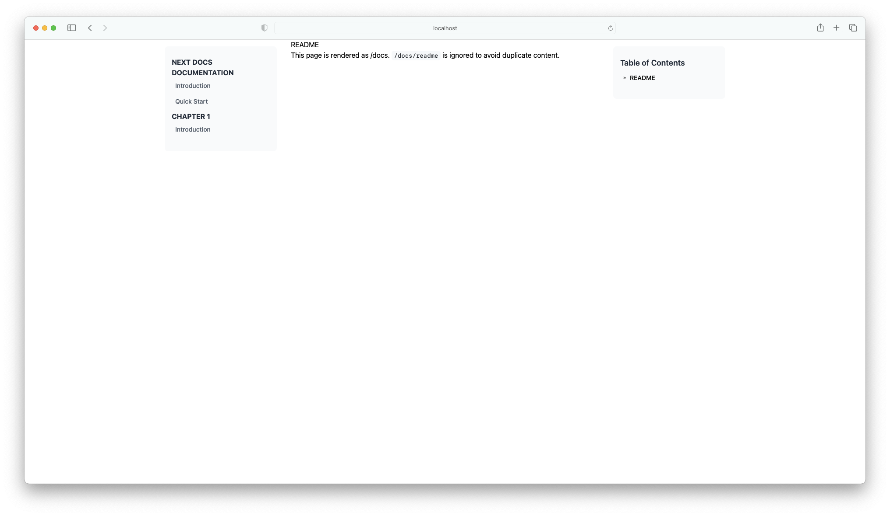

<p align="center">
  
</p>

# Next.js Product Docs Minimal Example

This is an example repo for the Next.js Product Documentation component.

- [Read the full article about the component](http://opstrace.com/blog/product-documentation-with-nextjs)
- [Check out the component repo with complete installation and usage instructions](https://github.com/opstrace/next-product-docs)

## Installation

```bash
    npm install
    # or yarn install
    cp env.example .env
```

The remote repository for the docs can be configured through environment
variables in `.env`. If your repository is private, you'll need to provide a
[Personal Access Token](https://github.com/settings/tokens) with the correct
permissions as `GITHUB_TOKEN`.

## Local Development

```bash
    npm run dev
    # or yarn dev
    npm run link-docs-component
    # or yarn link-docs-component (link next-docs-component)
    npm run unlink-docs-component
    # or yarn unlink-docs-component (unlink next-docs-component)
```

## How to link next-product-docs component

1. Clone this repo
2. Clone [next-product-docs](https://github.com/zentered/next-product-docs) on
   the same folder level
3. Install dependincies in both folders
4. Move to `next-product-docs` folder and run `npm run build` or `npm run watch`
5. Move to `next-product-docs-example` folder and run
   `npm run link-docs-component`
6. Run `npm run dev` and check result on `http://localhost:3000`
